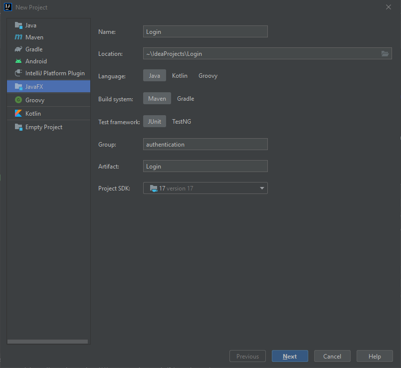
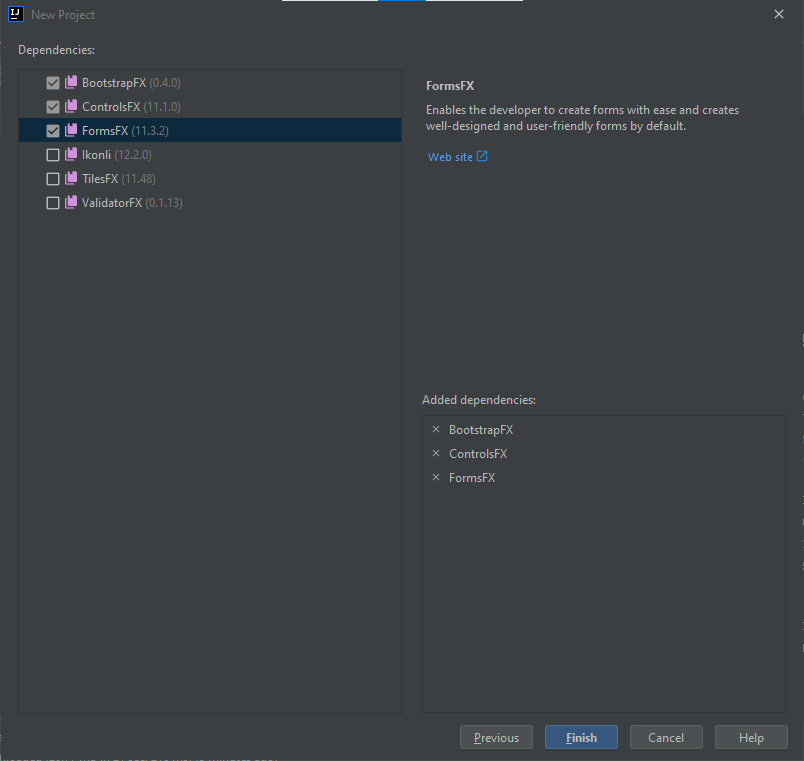
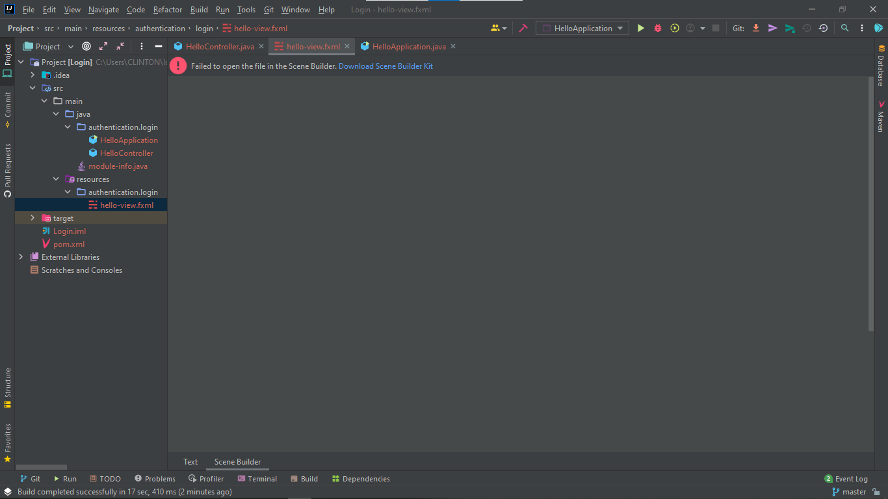
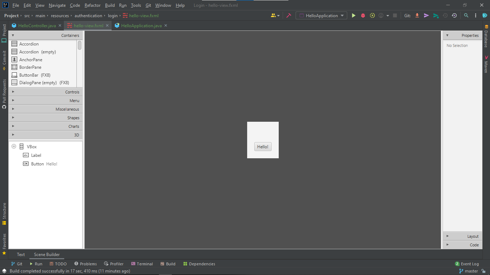
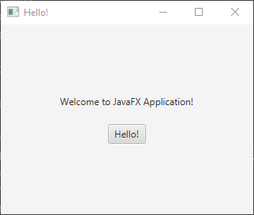
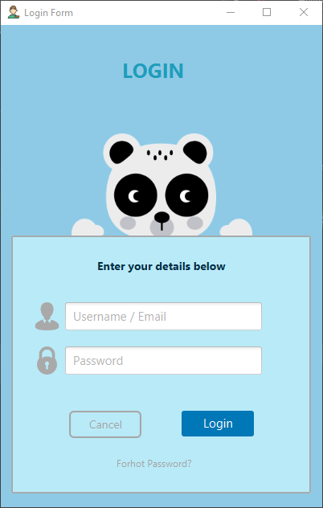
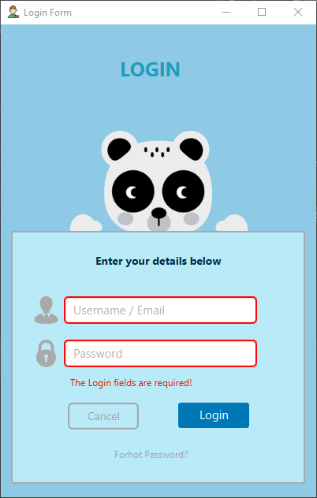
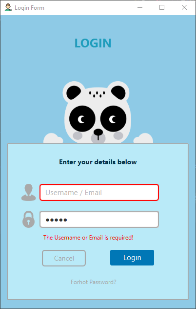
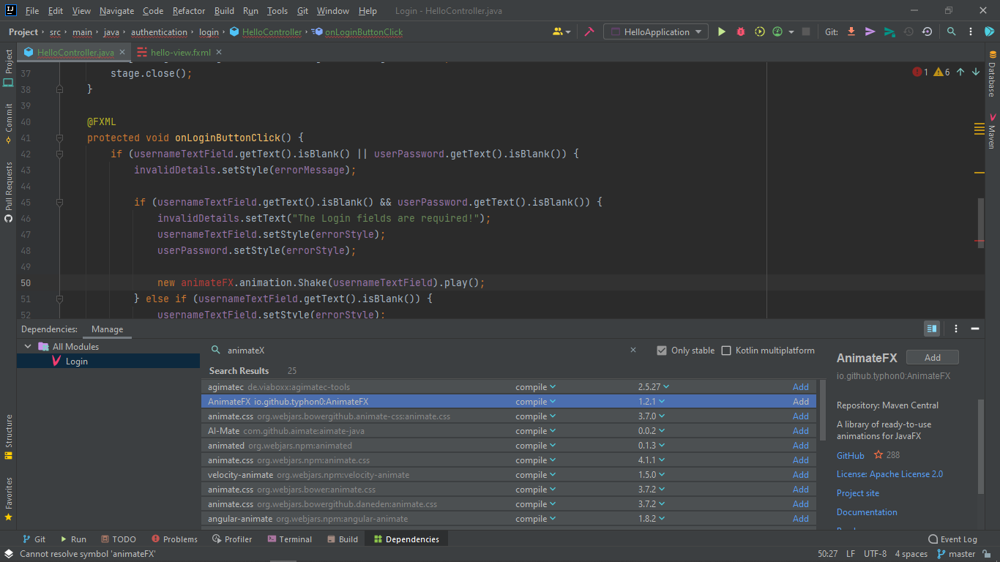

# Creating-an-Animated-JavaFX-field-Validation-alert
This repo has the code on how to create an Animated JavaFX field Validation alert. Download it, clone or modify as you may want for learning purposes or for your project.

The project looks as follows:

## When new project is created

## Setup Scene Builder

## Running the first project

## Modify the Scene

## Add some validations to the form

### No input

### No username

### No password

### Less than four characters

### When success

## Add AnimateFX

## Final product

